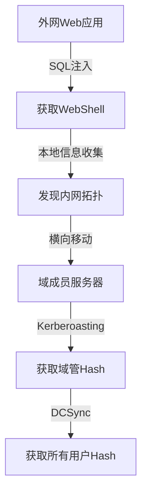

# 报告编写

## 报告结构

```
1. 项目概述
   - 项目名称、测试时间、测试范围、测试方法

2. 执行摘要
   - 发现漏洞总数、严重/高/中/低分布
   - 整体安全评级

3. 详细发现
   每个漏洞包含：
   ├── 漏洞名称
   ├── 严重等级 (Critical/High/Medium/Low/Info)
   ├── 影响范围
   ├── 验证步骤（含完整请求/响应）
   ├── 证据截图
   ├── PoC脚本
   └── 修复建议

4. 攻击路径
   - 从初始访问到最终目标的完整路径图

5. 附件
   - PoC脚本
   - 流量抓包
   - 截图证据
```

## 漏洞严重等级定义

| 等级 | CVSS | 描述 | 示例 |
|------|------|------|------|
| Critical | 9.0-10.0 | 远程代码执行、完全控制 | RCE、SQL注入+数据泄露 |
| High | 7.0-8.9 | 敏感数据泄露、权限提升 | XSS存储型、IDOR |
| Medium | 4.0-6.9 | 需要用户交互、部分影响 | 反射型XSS、信息泄露 |
| Low | 0.1-3.9 | 轻微安全问题 | 版本泄露、CORS配置 |
| Info | 0.0 | 信息性发现 | 目录列表、Banner |

## 漏洞描述模板

```
### [漏洞名称]

**严重等级**: Critical/High/Medium/Low
**漏洞类型**: SQL注入/XSS/...
**影响URL**: https://target.com/vulnerable-endpoint
**影响范围**: 描述受影响的系统/数据

**漏洞描述**:
简要描述漏洞的原理和危害

**验证步骤**:
1. 步骤1
2. 步骤2
...

**PoC**:
```
完整的请求/响应或PoC代码
```

**修复建议**:
具体的修复方案和代码示例
```

## CVSS评分计算

```
CVSS:3.1/AV:N/AC:L/PR:N/UI:N/S:U/C:H/I:H/A:H

AV: Attack Vector (N/A/P/L)
AC: Attack Complexity (L/H)
PR: Privileges Required (N/L/H)
UI: User Interaction (N/R)
S: Scope (U/C)
C/I/A: Confidentiality/Integrity/Availability (N/L/H)
```

## 自动化报告生成

- 自动生成逆向报告
- 渗透测试报告模板
- CTF writeup模板
- 攻击路径可视化（Mermaid/Graphviz）

### Mermaid攻击路径图

